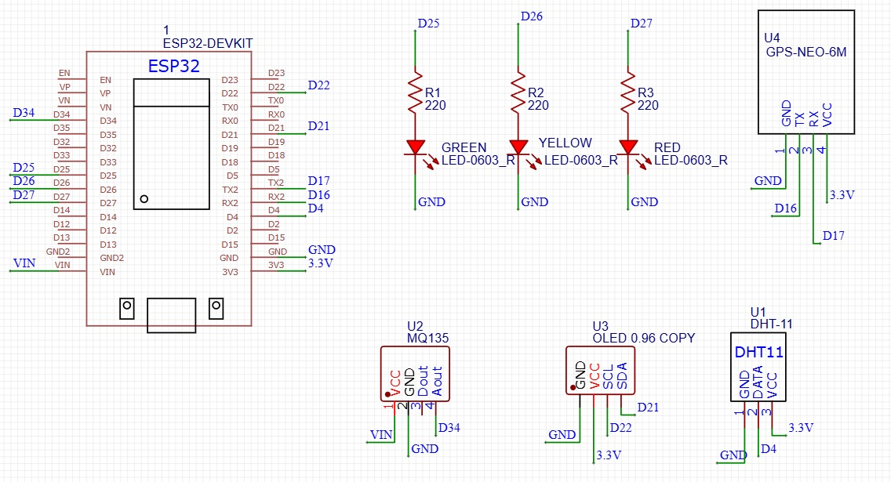

# 🌿 Air Quality Monitoring System (ESP32 + Blynk IoT)

## 📌 Project Overview
This project is an IoT-based Air Quality Monitoring System built using **ESP32 (Arduino framework)**.  
It measures air quality using the **MQ135 gas sensor** and temperature/humidity using the **DHT11 sensor**.  

Air quality levels are indicated using LEDs and monitored remotely through the **Blynk IoT Cloud platform**.

## 🧰 Technology Stack

**Programming Language:**  
- C++ (Arduino Framework)

**Platform & Tools:**  
- Arduino IDE  
- ESP32 Board Package  
- Blynk IoT Platform (Cloud + Mobile App)

**Libraries Used:**
- WiFi.h  
- BlynkSimpleEsp32.h  
- DHT.h  

---

## 🛠 Hardware Components

- ESP32 Microcontroller  
- MQ135 Gas Sensor  
- DHT11 Temperature & Humidity Sensor  
- Green LED (Good Air Quality)  
- Blue LED (Moderate Air Quality)  
- Red LED (Harmful Air Quality)  
- Resistors  
- Breadboard & Jumper Wires  

---

## ⚙️ System Working

1. MQ135 continuously senses air quality levels.
2. ESP32 reads analog values from the MQ135 sensor.
3. Based on predefined threshold values:
   - 🟢 Green LED → Good  
   - 🔵 Blue LED → Moderate  
   - 🔴 Red LED → Harmful  
4. DHT11 collects temperature and humidity data.
5. ESP32 sends sensor data to Blynk Cloud over WiFi.
6. Data is visualized in real-time on the Blynk mobile application.

---

## 🔌 Circuit Diagram



---

## ☁️ Blynk Cloud Integration Setup

1. Create an account on **Blynk IoT Platform**.
2. Create a new template and device.
3. Copy the **Auth Token**.
4. Paste the token inside the code:

```cpp
#define BLYNK_AUTH_TOKEN "YourAuthTokenHere"
```

5. Enter your WiFi credentials:

char ssid[] = "YourWiFiName";
char pass[] = "YourWiFiPassword";

6. Add widgets in the Blynk app to display:

Gas sensor value
Temperature
Humidity

--

## ▶️ How to Run the Project

### 1️⃣ Install Requirements
- Install **Arduino IDE**
- Install **ESP32 Board Package**
- Install required libraries:
  - Blynk
  - DHT Sensor Library

### 2️⃣ Hardware Connections
- Connect MQ135 to ESP32 analog pin  
- Connect DHT11 to a digital pin  
- Connect LEDs to digital output pins using resistors  

### 3️⃣ Upload the Code
1. Open `air-quality-monitoring-system.ino`
2. Select **Board → ESP32**
3. Select the correct **COM Port**
4. Click **Upload**

### 4️⃣ Monitor the System
- Open **Serial Monitor** for debugging  
- Open the **Blynk app** to view real-time data  

---

## 🎥 Demo Video
[Watch Project Demo](https://drive.google.com/file/d/1TI3VHRtya2As3mA0z4Za6jyWypq4IFRu/view?usp=sharing)

---

## 🚀 Future Scope
Integration of a GPS Neo module for location-based air quality tracking and an OLED display for real-time on-device visualization.

